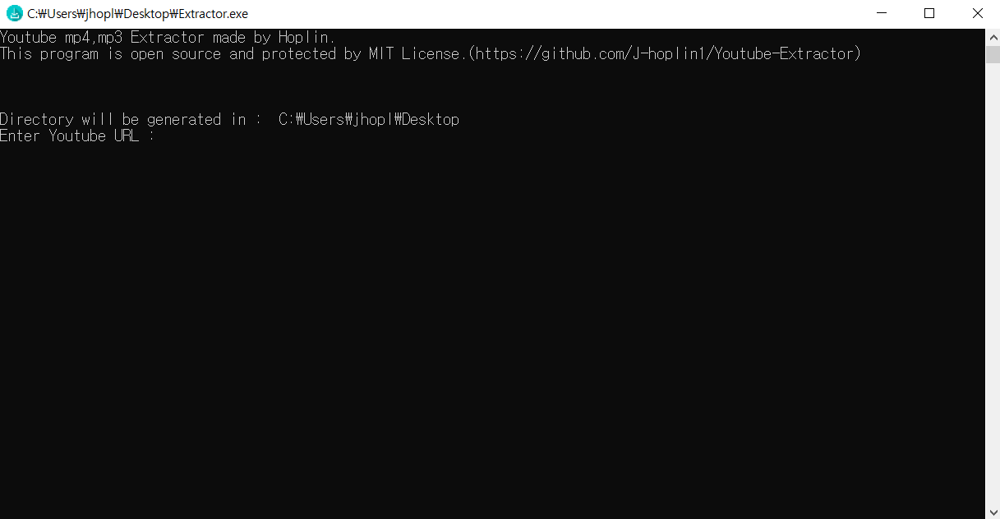
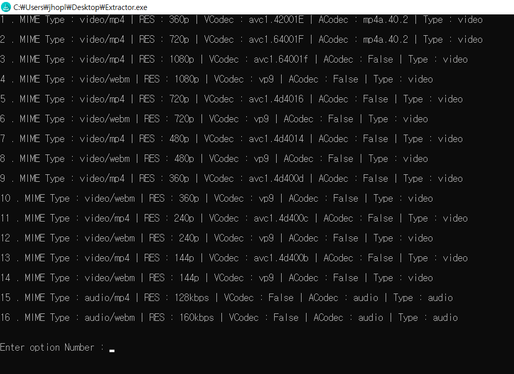
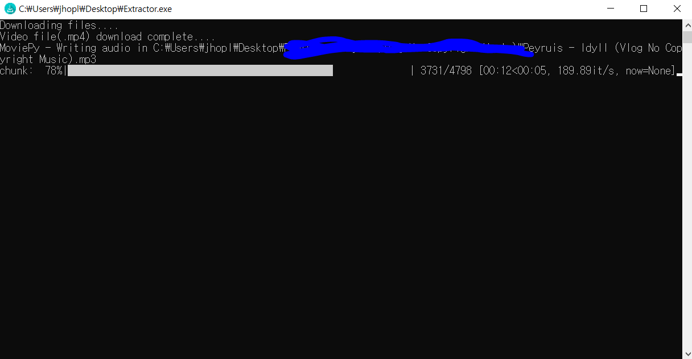

Youtube mp3,mp4 Extractor
===
***
- Language : Python3(Version 3.7.6)

- IDE : Jetbrain Pycharm

- What for? : To extract mp3,mp4 files from youtube

- exe Link : https://drive.google.com/open?id=16VJhb06olhojxTh-8O15swvQRt7ps9-b

- **Warning : You shouldn't use openly or share downloaded mp3 or mp4 files. If you violate this, you can be punished by copyright law.** 
***
- ACodec False meadns, that types of download has no audio.

- VCodec False means, that types of download has no video

- Recommend to download - VCodec : avc1 , ACodec : mp4a option

- When you want to delete video file but makes error 'ffmpeg-win64', check if extractor program is closed
***
- 20200411 Patch Note

    - Exception Handling
    
    - Unexpected bug fix
***

1. It'll take some time when execute program for the first time.

2. When you first execute program you need to enter URL of video you want to extract. If entered link is not types of youtube video, program will be closed

    

3. After you enter youtube link properly, you need to select download option. If you run a program with a small window, you may not see some options, so you need to view the program on the full screen or scroll up. (Usually option is from 1~16)

    

4. When you select option, program will make directory in same directory with this program and download mp3,mp4 files of link.

    
